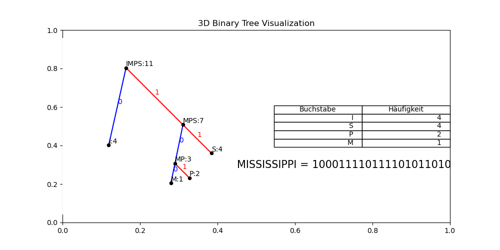

# Huffman Code Visualization

This Python repository includes scripts for visualizing the Huffman coding algorithm using Matplotlib. The Huffman coding algorithm is a widely used method for lossless data compression.

## Table of Contents

- [Overview](#overview)
- [Usage](#usage)
- [Example](#example)
- [Getting Started](#getting-started)
- [Dependencies](#dependencies)
- [Contributing](#contributing)
- [License](#license)

## Overview

The repository consists of a Python script that demonstrates & visualizes the Huffman coding algorithm. It visualizes the Huffman tree (3D) , frequency tables, and encoding of text using Huffman coding.

## Usage

1. **Run the Code:** Clone this repository and execute the `Huffman.py` script.
2. **Input Text:** Enter a text string when prompted to create a Huffman encoding visualization and display the encoded output.
3. **Visualizations:** The script generates visualizations of the Huffman tree, frequency tables, and encodings using Matplotlib.

## Example



## Getting Started

To run the code:

1. Clone this repository to your local machine.
2. Ensure you have Python installed (Python 3 recommended).
3. Install the required dependencies mentioned in the `Dependencies` section.
4. Run the `Multimedia.py` script.

## Dependencies

The following dependencies are required to run the scripts:
- Python (3.x recommended)
- Matplotlib

Install Matplotlib using pip:

```bash
pip3 install matplotlib
```

## Contributing

Contributions are welcome! Feel free to open issues or pull requests to improve the code, add new features, or fix bugs.

## License

This project is licensed under the [MIT License](LICENSE).
